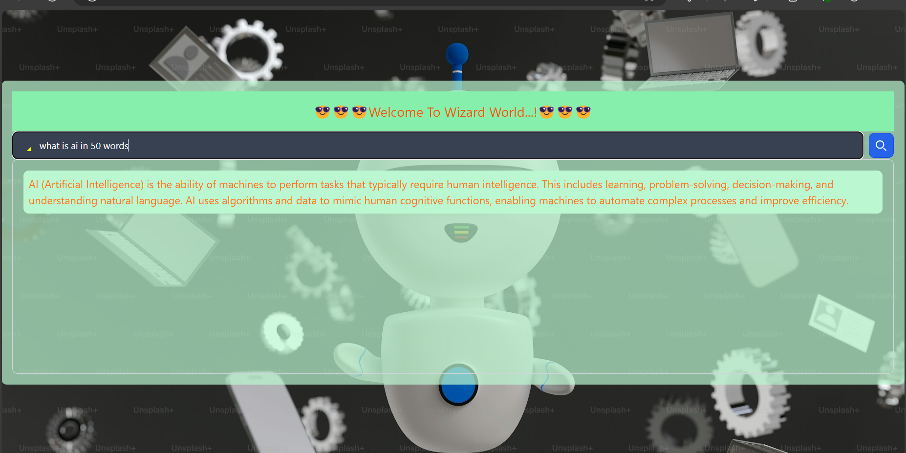

# Wizard World AI Search

Welcome to the **Wizard World AI Search** project! This web application allows users to ask questions via a search bar and receive AI-generated responses displayed in a user-friendly textarea. The application uses React, Tailwind CSS, and integrates with an AI language model for content generation.



## Features

- **AI-Powered Search**: Ask questions and receive AI-generated responses.
- **Real-Time Typing Effect**: Responses appear in the textarea with a real-time typing effect.
- **Loader Animation**: Shows a loader animation while the AI is generating a response.
- **Stylish UI**: Clean and modern design using Tailwind CSS.
- **Full-Page Background Image**: Engaging background image that covers the entire page.

## Installation

To run this project locally, follow these steps:

1. **Clone the repository**:
   ```bash
   git clone https://github.com/ManavRastogi03/WizardAiGenerate.git
   cd GetAns
